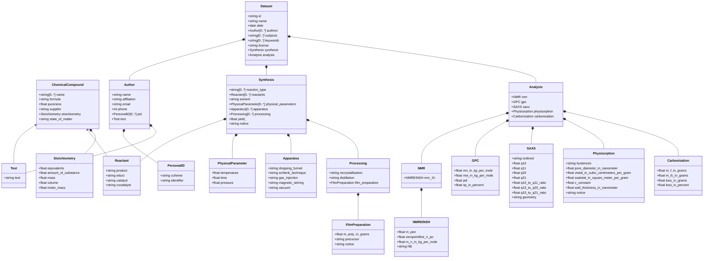

```mermaid
classDiagram
    ChemicalCompound <-- Test
    ChemicalCompound <-- Reactant
    Dataset *-- Author
    Dataset *-- Synthesis
    Dataset *-- Analysis
    Author *-- PersonalID
    Author *-- Test
    Synthesis *-- Reactant
    Synthesis *-- PhysicalParameter
    Synthesis *-- Apparatus
    Synthesis *-- Processing
    ChemicalCompound *-- Stoichiometry
    Processing *-- FilmPreparation
    Analysis *-- NMR
    Analysis *-- GPC
    Analysis *-- SAXS
    Analysis *-- Physisorption
    Analysis *-- Carbonization
    NMR *-- NMREINSH
    
    class Dataset {
        +string id*
        +string name*
        +date date*
        +Author[0..*] authors*
        +string[0..*] subjects*
        +string[0..*] keywords*
        +string license*
        +Synthesis synthesis*
        +Analysis analysis
    }
    
    class Author {
        +string name*
        +string affiliation*
        +string email*
        +int phone
        +PersonalID[0..*] pid
        +Test test
    }
    
    class Test {
        +string test
    }
    
    class PersonalID {
        +string scheme*
        +string identifier*
    }
    
    class Synthesis {
        +string[0..*] reaction_type
        +Reactant[0..*] reactants*
        +string solvent
        +PhysicalParameter[0..*] physical_parameters*
        +Apparatus[0..*] apparatus
        +Processing[0..*] processing
        +float yield_*
        +string notice
    }
    
    class ChemicalCompound {
        +string[0..*] name
        +string formula
        +float pureness
        +string supplier
        +Stoichiometry stoichiometry
        +string state_of_matter
    }
    
    class Reactant {
        +string product
        +string educt
        +string catalyst
        +string cocatalyst
    }
    
    class Stoichiometry {
        +float equivalents
        +float amount_of_substance
        +float mass
        +float volume
        +float molar_mass
    }
    
    class Apparatus {
        +string dropping_funnel
        +string schlenk_technique
        +string gas_injection
        +string magnetic_stirring
        +string vacuum
    }
    
    class Processing {
        +string recrystallisation
        +string distillation
        +FilmPreparation film_preparation
    }
    
    class FilmPreparation {
        +float m_poly_in_grams*
        +string precursor
        +string notice
    }
    
    class PhysicalParameter {
        +float temperature
        +float time
        +float pressure
    }
    
    class Analysis {
        +NMR nmr
        +GPC gpc
        +SAXS saxs
        +Physisorption physisorption
        +Carbonization carbonization
    }
    
    class NMR {
        +NMREINSH nmr_1h
    }
    
    class NMREINSH {
        +float m_peo*
        +float zeropointfive_n_po
        +float m_n_in_kg_per_mole
        +string hlb
    }
    
    class GPC {
        +float mn_in_kg_per_mole*
        +float mw_in_kg_per_mole
        +float pdi
        +float sp_in_percent
    }
    
    class Carbonization {
        +float m_f_in_grams*
        +float m_fc_in_grams
        +float loss_in_grams
        +float loss_in_percent
    }
    
    class SAXS {
        +string ordered*
        +float q10
        +float q11
        +float q20
        +float q21
        +float q10_to_q11_ratio
        +float q10_to_q20_ratio
        +float q10_to_q21_ratio
        +string geometry
    }
    
    class Physisorption {
        +string hysteresis*
        +float pore_diameter_in_nanometer
        +float vtotal_in_cubic_centimeters_per_gram
        +float ssatotal_in_square_meter_per_gram
        +float c_constant
        +float wall_thickness_in_nanometer
        +string notice
    }
    
```